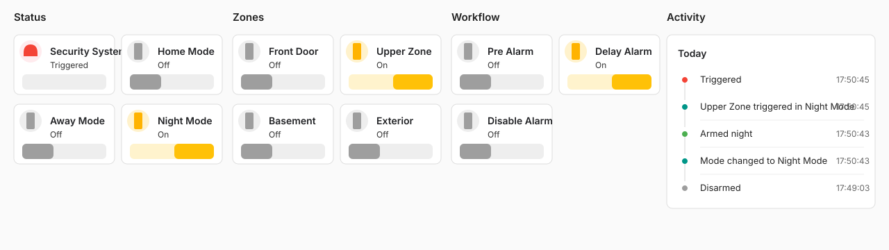

# Zoned Security for Home Assistant

Zoned Security is a YAML-configured Home Assistant custom integration for a
zone-based alarm workflow. It exposes one alarm control panel plus helper
switches for modes, zones, pre-alarm, delayed alarm, manual inhibition, and
notifications.

It is designed for households that want Home Assistant to own the alarm state
while HomeKit automations feed zone triggers into Home Assistant. It can also be
used entirely from Home Assistant automations.

## Project Lineage

This project is inspired by a customized alarm setup built around the former
`homebridge-automation-switches` Homebridge plugin. The original plugin provided
useful primitives for a HomeKit-facing security system and automation switches.
The delayed alarm, manual inhibition, and pre-alarm workflow documented here were
implemented by combining those primitives with additional automations.

Zoned Security brings that pattern into Home Assistant so the alarm state can be
managed locally and then optionally exposed to HomeKit through Home Assistant's
HomeKit Bridge.

## Features

- Alarm control panel with `home`, `away`, `night`, and `disarmed` states.
- Configurable zone switches.
- Configurable mode switches.
- Helper switches for delayed alarm, pre-alarm, and manual alarm inhibition.
- Optional notification services for alarm, inhibited alarm, and pre-alarm events.
- Logbook activity entries for mode changes, zone triggers, and alarm outcomes.
- Persisted alarm mode and zone state when enabled.

## Intended HomeKit Usage

A common deployment model is:

1. Configure the alarm system and zones in Home Assistant.
2. Expose the alarm control panel and selected switches through Home Assistant's
   HomeKit Bridge.
3. Keep existing HomeKit automations responsible for deciding when a real sensor
   should turn on a zone switch.
4. Let Zoned Security handle the shared alarm state, delay window, inhibition,
   notifications, and cleanup behavior.

This keeps sensor-specific logic in HomeKit when desired, while centralizing the
alarm state machine in Home Assistant.

## Dashboard Example

Zoned Security does not create a Lovelace dashboard automatically, but a compact
testing view is useful while wiring automations. A typical dashboard groups the
alarm panel and mode switches, zone switches, workflow helpers, and Logbook
activity in separate sections:



## Status

This is an early custom integration. It is not a certified alarm system and should
not be used as the only safety-critical security layer.

Version `0.1.x` is intended for one configured security system. The YAML schema is
structured under `systems` for future expansion, but multiple concurrent systems
are not a supported public contract yet.

## Installation with HACS

This repository can be installed as a HACS custom repository.

[](https://my.home-assistant.io/redirect/hacs_repository/?owner=aspaviento&repository=homeassistant-zoned-security&category=integration)

1. Open HACS in Home Assistant.
2. Go to custom repositories.
3. Add `https://github.com/aspaviento/homeassistant-zoned-security` as an
   `Integration`.
4. Install `Zoned Security`.
5. Add a YAML configuration, for example by adapting
   `examples/zoned_security.yaml`.
6. Restart Home Assistant.

Zoned Security is currently YAML-based. After installing it from HACS, do not use
Settings -> Devices & services -> Add integration for setup. Configure it in
YAML instead.

## Manual Installation

Copy `custom_components/zoned_security` into your Home Assistant
`custom_components` directory, then add a YAML configuration.

For a package-based setup, copy `examples/zoned_security.yaml` to your Home
Assistant `packages` directory and adapt it to your zones and notification service.

Restart Home Assistant after installing or changing the integration code.

## Configuration

The integration is configured under the `zoned_security` YAML key.

Top-level options:

- `systems`: map of configured security systems. Version `0.1.x` supports one
  public production system even though the schema is shaped for future expansion.

System options:

- `name`: display name for the alarm control panel.
- `default`: initial state. Accepted values are `disarmed`, `unarmed`,
  `armed-home`, `armed-away`, and `armed-night`.
- `stored`: whether the target alarm mode and zone states are persisted.
- `modes`: display names for `home`, `away`, and `night` mode switches.
- `zones`: list of zone definitions.
- `helpers`: helper switch definitions.
- `notifications`: optional Home Assistant notification service calls.

Zone options:

- `name`: display name for the zone switch and notification context.
- `object_id`: stable slug used to build the zone switch entity ID.

Helper options:

- `name`: display name for the helper switch.
- `period`: optional timer duration in seconds.
- `auto_off`: whether the helper turns itself off when the timer expires.
- `stored`: reserved for helper persistence. Helpers are normally transient.

Notification options:

- `service`: Home Assistant notification service, such as `notify.notify` or a
  mobile-app notification service.
- `title`: notification title.
- `message`: base message.
- `priority`: optional notification priority passed as service data.
- `sound`: optional notification sound passed as service data.
- `mute_seconds`: per-notification throttle period.

## Pushover Notifications

Zoned Security does not depend on Pushover, but it works well with Home
Assistant's Pushover notification integration. This is useful when Home
Assistant should send alarm notifications directly instead of routing that
responsibility through HomeKit automations.

First configure Pushover in Home Assistant. Then reference the resulting notify
service in `notifications`:

```yaml
notifications:
  alarm:
    service: notify.pushover
    title: Security System
    message: Alarm activated
    priority: 1
    sound: siren
    mute_seconds: 60
  alarm_inhibited:
    service: notify.pushover
    title: Security System
    message: Alarm inhibited
    priority: 0
    mute_seconds: 60
  prealert:
    service: notify.pushover
    title: Security System
    message: Pre-alarm activated
    priority: 0
    mute_seconds: 60
```

When the delayed alarm expires without inhibition, the `alarm` notification is
sent with additional context: mode, triggering zone, active zones, and time. When
the alarm is manually inhibited, `alarm_inhibited` is sent as a simple message
and the active zones are cleared.

## Example Configuration

```yaml
zoned_security:
  systems:
    main:
      name: Security System
      default: disarmed
      stored: true

      modes:
        away:
          name: Away
        night:
          name: Night
        home:
          name: Home

      zones:
        - name: Front Door
          object_id: front_door_zone
        - name: Patio
          object_id: patio_zone

      helpers:
        delay_alarm:
          name: Delay Alarm
          period: 60
          auto_off: true
          stored: false
        pre_alarm:
          name: Pre Alarm
          period: 60
          auto_off: true
          stored: false
        disable_alarm:
          name: Disable Alarm
          stored: false

      notifications:
        alarm:
          service: notify.notify
          title: Security System
          message: Alarm activated
          priority: 1
          mute_seconds: 60
        alarm_inhibited:
          service: notify.notify
          title: Security System
          message: Alarm inhibited
          priority: 0
          mute_seconds: 60
        prealert:
          service: notify.notify
          title: Security System
          message: Pre-alarm activated
          priority: 0
          mute_seconds: 60
```

## Entities

For a system configured with the example above, the integration creates:

- `alarm_control_panel.zoned_security`
- `switch.zoned_security_home_mode`
- `switch.zoned_security_away_mode`
- `switch.zoned_security_night_mode`
- `switch.zoned_security_delay_alarm`
- `switch.zoned_security_pre_alarm`
- `switch.zoned_security_disable_alarm`
- one zone switch per configured zone, for example
  `switch.zoned_security_front_door_zone`

The alarm control panel exposes these attributes:

- `target_state`: the armed/disarmed target state.
- `mode`: `home`, `away`, `night`, or `null`.
- `active_zones`: current active zone names.

## Services

Zoned Security does not currently register custom Home Assistant services.

Use the normal Home Assistant services for its entities:

- `alarm_control_panel.alarm_arm_home`
- `alarm_control_panel.alarm_arm_away`
- `alarm_control_panel.alarm_arm_night`
- `alarm_control_panel.alarm_disarm`
- `switch.turn_on`
- `switch.turn_off`

## Workflow

Zoned Security is intentionally built as a small state machine plus helper
switches. The integration owns the alarm mode, active zones, helper timers, and
notifications. The user decides which automations turn zones on and which
downstream actions should happen when helper switches change state.

### Optional Pre-Alarm

`pre_alarm` can be used as a first-stage filter before a real zone trigger. This
is useful when some sensors may create occasional false positives: the first
activation can turn on `pre_alarm`, send the configured `prealert` notification,
and auto-off after its configured period. A later activation, while the
pre-alarm condition is still relevant, can then turn on the real zone switch.

This helper is optional. If a deployment does not need a two-step alarm model,
sensor automations can trigger zones directly.

### Zone Trigger and Delay

When the system is armed and a zone switch turns on, the alarm enters
`triggered`. If the `delay_alarm` helper exists, Zoned Security turns it on and
starts its configured timer.

During this delay window, a user or automation can turn on `disable_alarm` to
manually inhibit the alarm. If the timer expires and `disable_alarm` is off, the
integration sends the configured `alarm` notification with the mode, triggering
zone, active zones, and time, then turns `delay_alarm` off.

### Manual Inhibition

`disable_alarm` is evaluated when `delay_alarm` expires. If it is on, Zoned
Security sends the configured `alarm_inhibited` notification, turns
`disable_alarm` off, clears active zones, and returns the system to its armed
base state.

### Custom Actions

Home Assistant and HomeKit automations can react to any helper state change.
Typical examples include starting a siren or turning on lights when
`delay_alarm` expires without inhibition, sending an early warning when
`pre_alarm` turns on, or showing a manual cancellation workflow while
`disable_alarm` is active.

## Data and Storage

When `stored: true`, Zoned Security stores the target alarm state and active zone
states using Home Assistant's storage helpers. It does not store notification
credentials. Notification credentials, if any, remain owned by the configured
Home Assistant notification integration.

## External References

This integration is inspired by a customized Homebridge alarm workflow based on
the former `homebridge-automation-switches` security-system and automation
switch primitives. The original repository is no longer available in its
previous location, but archived documentation may still be useful for
understanding the Homebridge behavior that motivated this project.

## License

MIT

## Notes

This integration is currently YAML-based and does not implement a Home Assistant
config flow. The integration page will therefore show that it was not set up from
the UI.
